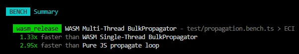
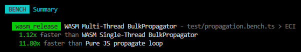

```ts
const now = new Date();
const results = entireSatelliteDatabase
  .map(satRec => propagate(satRec, now));
```

If you tried running this, you know the results: slowdowns which are not suitable for realtime applications.

This is where we went for a mission to make the **fastest theoretically possible SGP4/SDP4 implementation** available in JavaScript. Meet WebAssembly and _a lot_ of optimization techniques under the hood.

<!-- truncate -->

## Background

The Satellite.js library has originally started as a port of the [Python sgp4 library](https://pypi.org/project/sgp4/), which in turn has its roots in [the C++ code by David Vallado](https://github.com/CelesTrak/fundamentals-of-astrodynamics).

My idea of trying out WASM on this library has been lingering from around 2023 - pretty much the very moment I found out about the library. The library is pure calculations - and it's exactly one of the main use cases for WASM.

## Prior art

I was not the first person with this idea, however. I know of 2 previous attempts to make SGP4 on WASM, one of which was never open-sourced, and the second, Rust-based, was apparently abandoned a few years ago due to the worse performance than expected.

One of the hard parts about WASM is: **you can only pass numbers between WASM and JS**. You can't simply pass Objects and Arrays between the JS and the WebAssembly worlds with no overhead.

> But there are accessible and easy options to serialize objects and other data and still pass it into WASM!

Yes. Here's what comes next though: the overhead of serialization suddenly **outweighs** the performance benefits of calculating in WASM. A developer who tried to push for performance suddenly sees a _worse_ performance than that of JS and abandons the idea.

But there's more to it: not only your WASM must be fast. It must be faster than what the JS engine achieves when optimizing the JavaScript code. And **JS engines now are incredibly powerful in optimization**.

## Just do less

That's the simplest idea of optimization: literally, spend less cycles of the user's CPU to achieve the result.

Here's how we do it.

## 1. No JavaScript overhead

The pure JavaScript `sgp4` function does pure JavaScript things, such as it constructs a few JS objects which have to be garbage collected. Modern engines are able to optimize intermediate objects away, but it doesn't happen consistently. The more stuff you do besides simply SGP4, such as you transform coordinates, calculate shadow status etc, the more likely it is that engine optimization fails somewhere.

In our tests we had nearly identical JS code, calculating exactly the same thing, differing by 5x to 10x in performance.

The C++ version does the identical math but writes directly into **pre-allocated flat arrays**:

```cpp
r[0] = (mrt * ux) * satrec.radiusearthkm;
r[1] = (mrt * uy) * satrec.radiusearthkm;
r[2] = (mrt * uz) * satrec.radiusearthkm;
```

Zero object allocation means no dependence on a JS engine figuring out optimization every time and more consistent run times.

The same applies to all transforms. Every JS transform function - `eciToEcf`, `eciToGeodetic`, `ecfToLookAngles` - returns a new JS object. The C++ equivalents write into flat `double` arrays in-place.

## 2. No translation of values between WASM and C++ side

A common pitfall of WASM integration is costly marshalling at the JS-WASM boundary. We avoid this entirely.

The key innovation: our C++ code **generates a JSON description of its own struct layout** at runtime - field names, byte offsets, types, and sizes, which looks like this:

```json
[
  // [field name, type, offset, size]
  ["inclo", "double", 760, 8],
  ["nodeo", "double", 768, 8],
  ["ecco", "double", 776, 8],
  ["argpo", "double", 784, 8],
  // ...for all ~80 fields
]
```

This layout is queried **once** at runtime creation. Then the JS side **directly writes SatRec objects into C++ structs in WASM heap memory** using `DataView`. `DataView.setFloat64`, `setInt32`, `setInt8` - field values are placed where C++ struct expects them. **No serialization, no JSON, no marshalling.**

The same approach is used for a struct called `RunData` which carries options such as input/output pointers, enabled calculators and their settings, during a `run()` call.

**Reading results is zero-copy too.** Calculator `getRawOutput()` methods return `TypedArray` views directly on WASM heap memory:

```ts
getRawOutput() {
  return {
    position: new Float64Array(
      this.module.HEAP8.buffer, this.outputPointer, outputSize),
    velocity: new Float64Array(
      this.module.HEAP8.buffer, /* ... */),
    error: new Int8Array(
      this.module.HEAP8.buffer, /* ... */),
  };
}
```

These are **views**, not copies, on WASM linear memory.

## 3. Minimal memory allocation, maximum reuse

Push a full LookAngles pipeline through, as of time of writing, entire database of over 30 000 satellites, and you're looking at allocating and collecting **hundreds of thousands of objects**.

The WASM path takes a different approach: **allocate everything once, reuse across every run.**

`BulkPropagator`'s constructor allocates exactly three things:

1. A satellite struct array (one allocation for all satellites)
2. A dates array (one allocation for all timestamps)
3. A **single contiguous output buffer** for all calculators

It then partitions this single buffer among calculators using byte offsets.

On subsequent `run()` calls: **zero new allocations**. The same buffers are overwritten. Re-allocation only happens if array sizes grow beyond the original capacity - and even then, it's a single `free` + `malloc` pair.

`BulkPropagator` implements `Disposable` and supports the new `using` syntax for the users to dispose of it conveniently.

## 4. Single Instruction Multiple Data

Since propagations can be highly parallel (each SatRec can be computed independently), and further coordinate transforms (ECI &rarr; ECF &rarr; LookAngles etc) are completely independent, there are huge potential benefits to have from Single Instruction Multiple Data (SIMD further down).

A recap on SIMD: to the existing `i32`, `i64`, `f32`, `f64` types it adds `v128` type, which is a 128-bit vector where you can pack, for example, 4 32-bit values, or 2 64-bit ones. You can create two of these and then use an instruction that multiplies the values in them. This means that, for 64-bit values, you can do 2 multiplications in one CPU cycle; and for 32-bit values - 4 multiplications, at once. There are a bunch of interpretations of `v128` vectors and instructions of them available and already implemented for WASM.

All our WASM builds are compiled with WebAssembly 128-bit SIMD instructions. The LLVM compiler auto-vectorizes loops where possible.

The transform functions - ECF conversion, GMST, LookAngles, DopplerFactor - all iterate over contiguous flat `double` arrays with simple arithmetic. These are ideal candidates for auto-vectorization. We also enable vectorization reporting (`-Rpass=loop-vectorize`) in our builds to verify what the compiler actually vectorizes.

## 5. Loop invariant code optimization

Processing arrays of satellites and dates opens multiple opportunities to identify code, which doesn't really depend on each satellite and each date. This code can then be called just once per its actual dependency. For example, if it depends on just dates and you compute 30 000 satellites for 1 date - you only calculate it once.

### Date conversion

In the JS path, `propagate()` calls `jday(date)` on every invocation to convert a `Date` to Julian day. For **N** satellites and **M** dates, that's **N\*M** `jday()` calls.

In the WASM path, `writeDatesArray` converts each date to Julian day **once** and writes it directly into WASM memory:

```ts
dates.forEach((date, index) => {
  module.HEAPF64[startOffset + index] = jday(date);
});
```

Here in WASM, Julian day is the first class citizen.

### Observer position

In JS, `ecfToLookAngles` calls `geodeticToEcf` internally - recomputing the observer's ECF position **every single time**:

```ts
// This runs inside every ecfToLookAngles call:
function geodeticToEcf({ longitude, latitude, height }) {
  const a = 6378.137;
  const b = 6356.7523142;
  const f = (a - b) / a;
  const e2 = ((2 * f) - (f * f));
  const normal = a / Math.sqrt(1 - (e2 * (Math.sin(latitude) * Math.sin(latitude))));
  // ...
}
```

In C++, Look Angles transform computes all of this **once before the loop**:

```cpp
void calculate_look_angles(
    /* ... */
    double longitude, double latitude, double height,
    /* ... */)
{
  // Computed once:
  double a = 6378.137;
  double b = 6356.7523142;
  double f = (a - b) / a;
  double e2 = ((2 * f) - (f * f));
  double normal = a / sqrt(1 - (e2 * (sin(latitude) * sin(latitude))));
  double observerEcfX = (normal + height) * cos(latitude) * cos(longitude);
  double observerEcfY = (normal + height) * cos(latitude) * sin(longitude);
  double observerEcfZ = ((normal * (1 - e2)) + height) * sin(latitude);

  // Then loop over all satellites * dates:
  for (int i = satellites_start; i < satellites_end; i++) {
    for (int j = dates_start; j < dates_end; j++) {
      // ...use precomputed observerEcf values
    }
  }
}
```

There are a few such examples.

## 6. One WASM boundary crossing for the full pipeline

In the JS path, computing LookAngles for one satellite at one date requires calling separate functions: `propagate()`, `gstime()`, `eciToEcf()`, `ecfToLookAngles()`.

The WASM path makes **one call**. The C++ `compute()` function chains every enabled calculation stage in a single invocation:

```cpp
void EMSCRIPTEN_KEEPALIVE compute(RunData* __restrict runData) {
  calculate_eci(/* ... */);
  if (runData->gmstEnabled)             calculate_gmst(/* ... */);
  if (runData->sunPositionEnabled)      calculate_sun_positions(/* ... */);
  if (runData->ecfPositionEnabled)      calculate_ecf_position_or_velocity(/* ... */);
  if (runData->ecfVelocityEnabled)      calculate_ecf_position_or_velocity(/* ... */);
  if (runData->geodeticPositionEnabled) calculate_geodetic_positions(/* ... */);
  if (runData->lookAnglesEnabled)       calculate_look_angles(/* ... */);
  if (runData->dopplerFactorEnabled)    calculate_doppler_factor(/* ... */);
  if (runData->shadowFractionEnabled)   calculate_shadow_fraction(/* ... */);
}
```

Intermediate results never leave WASM memory between stages. The ECI output feeds directly into ECF conversion via pointers in the `RunData` struct - no data copying, no JS objects, no boundary crossings.

This also means **unused stages are free**. Each calculator sets a boolean `Enabled` flag in `RunData`. If you don't need geodetic positions or Doppler factor, those branches aren't entered.

## 7. Cache-friendly flat memory layout

All WASM outputs are stored in flat contiguous `double` arrays, indexed as `[satellite_index * dates_count + date_index] * 3`.

Why does this matter?

- **Cache line friendliness.** Sequential iteration over contiguous memory means the CPU prefetcher can predict and load upcoming data. Minimal cache misses.
- **No pointer chasing.** In JS, accessing `result.position.x` requires following 2 pointer indirections through the V8 heap. In WASM, it's a single indexed read from a flat array.
- **SIMD-friendly.** Contiguous data means SIMD, as explained above.

## 8. Multi-threading via pthreads

The multi-thread build partitions the calculations across N threads. Each thread processes its own slice.

The multi-thread runtime is available via `createMultiThreadRuntime` and requires `SharedArrayBuffer` (plus the appropriate `Cross-Origin-Opener-Policy` / `Cross-Origin-Embedder-Policy` headers in browsers).

## Putting it all together

Here's a side-by-side summary of what happens when you propagate satellites through a LookAngles pipeline:

| | Pure JS | WASM BulkPropagator |
|---|---|---|
| **Execution** | JS JIT-compiled | WASM from C++ |
| **Object allocations per sat per date** | ~4-10+ JS objects | 0 (pre-allocated flat arrays) |
| **JS-native boundary crossings** | N/A | 1 per `run()` |
| **SIMD** | None, unless JIT does that | Auto-vectorized loops |
| **Multi-threading** | None - up to the user | Yes - in multi thread build |
| **Memory layout** | JS objects | Contiguous arrays, cache-friendly |
| **Date conversion** | Per satellite per date | Once per date |
| **Observer/constants** | Recomputed every call | Computed once before the loop |
| **Pipeline integration** | Separate function calls | Single `compute()` call |

## The results

Speak for themselves. As measured on Node v24.3, here's a benchmark where JIT was able to optimize JavaScript loops:



Here's where JIT failed and JS execution time jumped up, but WASM stayed just as fast as before:


